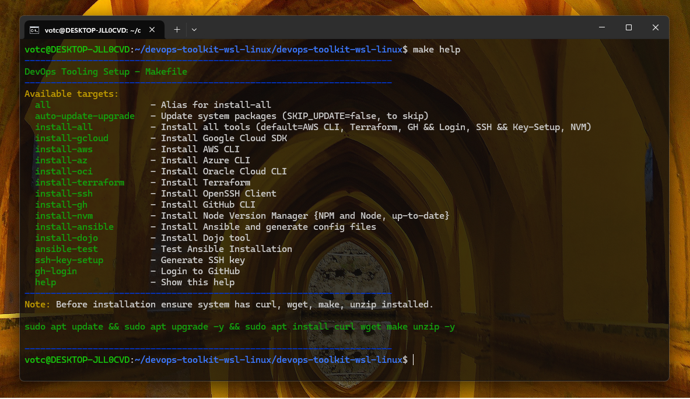

Hello Team,

I'm sharing a DevOps toolkit (Debian-based) created with GNU Make that I use to set up my personal environment.

I'm providing it here as an example of useful tools.<br>
Feel free to use it as is, or modify, remove, or add applications as needed.

<i>P.S.: Before using it, ensure your system has curl, wget, make, and unzip installed.</id>

```bash
sudo apt update && sudo apt upgrade -y && sudo apt install curl wget make unzip -y
```

<p align="center">
  
</p>