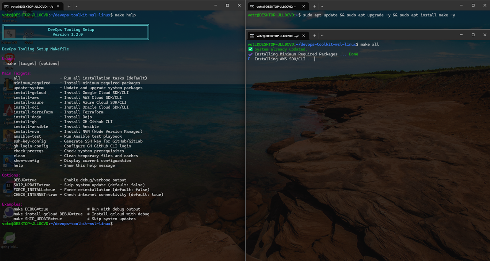

Sharing a DevOps toolkit (Debian-based) created with GNU Make that I use to set up my personal environment.

I'm providing it here as an example of useful tools.<br>

Feel free to study it, use it, modify, remove or add whatever you want.

<i>P.S.: Before using it, ensure your system has gnu make installed.</id>

```bash
sudo apt update && sudo apt upgrade -y && sudo apt install make -y
```

<p align="center">
  
  <br /><br />
  
  <br /><br />
  
  <br /><br />
  
</p>

## Installing all applications
make install-all

## Enable debug mode
make DEBUG=true

## Install gcloud without debug output
make install-gcloud

## Install gcloud with debug output
make install-gcloud DEBUG=true

## Skip system updates
make SKIP_UPDATE=true DEBUG=true

## Force reinstall with debug
make install-gcloud FORCE_INSTALL=true DEBUG=true

## Show help
make help

## Show current configuration
make show-config

## Clean up system
make clean DEBUG=true
